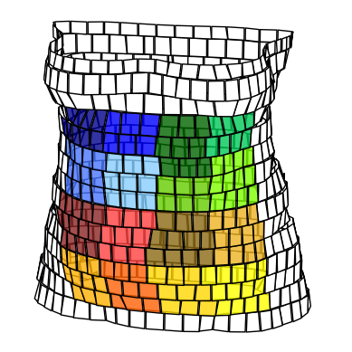

# An Ultra Wideband In-Body Channel model 
This Markdown file is optimized for GitLab. For correct rendering see the original repository at 
https://collaborating.tuhh.de/int/in-body/inbodychannel. 
## Introduction
This repository provides a stochastic ultra wideband in-body channel model for a capsule endoscopy applications. 
The stochastic channel model allows to randomly draw transfer functions between a transmitter placed in the digestive 
tract of a human to a receiver placed on the abdomen. Different modeling parameters for seven different 
 human body models are available. More details on the derivation of the model can be found in [BSB19].

The stochastic channel model is based on an approximation of the transfer function from the layer modeling approach 
 described in [BB17] (GitLab: [LayerModel_lib](https://collaborating.tuhh.de/int/in-body/layermodel_lib)) with
```math
\widehat{\mathcal{H}}(f) = \left(\text{e}^{a\cdot f\cdot 10^{-9}} + \text{e}^{b\cdot f\cdot 10^{-9}} + 
\text{e}^{c\cdot f\cdot 10^{-9}}\right) \text{e}^{j\left(\alpha\cdot f\cdot 10^{-9} + \beta\right)}
```
The approximation was done in the frequency range from 3.1 GHz to 4.8 GHz. 
For each human body model the stochastic distribution of the parameters $`(a, b, c, \alpha, \beta)`$ and the distance 
$`d`$ are described by 16 different Gaussian mixture models. The 16 different Gaussian mixture models for each human 
body model describe the variation in the location of the receive antenna on the body surface. The possible locations 
for receive antennas on the body surface were sorted into 16 clusters. The labeling of the clusters is as follows 
(if viewed from the front onto the abdomen):

| | | | | 
|---| ---|---|---|
| 00 | 01 | 10 | 11 |
| 02 | 03 | 12 | 13 |
| 20 | 21 | 30 | 31 |
| 22 | 23 | 32 | 33 |

Visualized with different colors the clusters on Donna look as depicted in the figure below. Hence, cluster 00 corresponds
to the dark blue cluster and the light red cluster in the center of the abdomen is cluster 21. 



### References
[BSB19] J.-C. Brumm, H. Strohm, and G. Bauch, “A Stochastic Channel Model for Ultra Wideband In-Body
Communication,” in *41st International Engineering in Medicine and Biology Conference 2019 (EMBC’2019)*. 
Berlin, 2019.

[BB17] J.-C. Brumm and G. Bauch, “On the Placement of On-Body Antennas for Ultra Wideband Capsule Endoscopy,” 
*IEEE Access*, vol. 5, pp. 10141–10149, 2017.

## List of all available body models
The following table gives an overview over the properties of the different human body models the stochastic 
channel model is based on. 
The upper 2 are available from the [University of Texas](http://sites.utexas.edu/austinmanaustinwomanmodels/) 
 and the last six from the [Helmholtz Zentrum München](https://www.helmholtz-muenchen.de/irm/service/virtual-human-download-portal/virtual-human-database/index.html) .

| Name |  Sex | Age | Size (cm) | Weight (kg) | Resolution |
|----- | ---- |---- |---------- |-------------| -----------|
|AustinMan | M | 38 | 180 | 106.2 | $`(2\cdot 2\cdot 2)mm^3`$ |
|AustinWoman | W | 59 | 173 | 84.8 | $`(2\cdot 2\cdot 2)mm^3`$ |
|Donna | W | 40 | 170 | 70 | $`(1.875 \cdot 1.875 \cdot 10) mm^3`$ |
|Golem |  M | 38 |176 | 69 | $`(2.08 \cdot 2.08 \cdot 8) mm^3`$ |
|Helga |  W    |26   | 170|81 | $`(0.98\cdot 0.98\cdot 10)mm^3 `$ |
|Irene |  W    | 32  | 163|51| $` (1.875\cdot 1.875\cdot 5)mm^3`$ |
|VisibleHuman |  M | 38 |180 | 103 | $`(0.91 \cdot 0.94 \cdot 5) mm^3`$ |

## Citation
This code is distributed under [MIT license](LICENSE). When using this code or parts of it for publications 
or research please cite this repository as:

[BS19] J.-C. Brumm, H. Strohm, "Python script for a stochastic channel model 
for ultra wideband in-body communication.'", https://collaborating.tuhh.de/int/in-body/inbodychannel

## Installation and Requirements
1. Download and install at least Python 3.6
2. The following Python packages are required:
   1. `scipy`
   2. `h5py`
   3. `scikit-learn`
    
2. Clone the git repository
3. Install the `inbodychannel` package using
```commandline
python setup.py install
```

## Example
This small example shows how to draw random parameters from the `StochasticChannelModel` and how to determine the 
transfer function from these samples. 
```python
import numpy as np
import matplotlib.pyplot as plt
from inbodychannel import StochasticChannelModel

# Load the stochastic channel model of Donna
scm = StochasticChannelModel('Donna')

# sample 100 parameter sets (a, b, c, alpha, beta, d) in total only from clusters 00 and 01
random_parameters, cluster_mapping = scm.sample(100, ['00', '01'])

# sample 100 parameter sets (a, b, c, alpha, beta, d) from all clusters
random_parameters, cluster_mapping = scm.sample(100)

# frequency vector from 3.1 GHz to 4.8 GHz
f = np.linspace(3.1e9, 4.8e9, 100)

# calculate the transfer function for each parameter set
for row in range(np.shape(random_parameters)[0]):
    parameters_tf = random_parameters[row, 0:5]
    transfer_function = scm.transfer_function(f, *parameters_tf)

    plt.plot(f, np.abs(transfer_function), label='cluster %s' % cluster_mapping[row])
    plt.legend()

```
